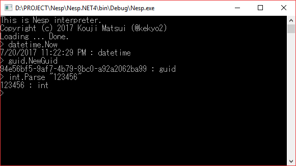

# Nesp - A Lisp-like lightweight functional language on .NET


## What's this?

* Nesp is a Lisp-like lightweight functional language on .NET
* Nesp is:
  * Very lightweight language syntax like Lisp's S-expression.
  * Applicable .NET library.
  * Expandable tokens.
  * Designed for easy embedding and useful on REPL.



* Still under construction...

## Nesp standard type names

* We can use C# like reserved type names (ex: int, short, string, double ...)
* Additional reserved type names (guid, datetime, timespan, type, math, enum)

## Nesp standard functions

* Numerical operators (+, -, *, /, %)
* TOOO: Declare function (define)

## Nesp REPL functions

* TOOO: Folder/file manipulations (ls, cd, mkdir)
* Clear screen (cls)
* REPL help (help)
* REPL exit (exit)

## Samples

* Basic tips: Nesp REPL mode not required brackets (...).

### Literals

```
> 12345
12345 : short
```

```
> 1234567890
1234567890 : int
```

```
> "abcdef"
"abcdef"
```

### Property reference

```
> datetime.Now
7/21/2017 12:04:43 AM : datetime
```

### No arguments function

```
> guid.NewGuid
bb11b743-f5fe-4d68-bbe3-22e05606b3a5 : guid
```

### Any arguments function

```
> int.Parse "12345"
12345 : int
```

```
> System.String.Format "ABC{0}DEF{1}GHI" 123 456.789
"ABC123DEF456.789GHI"
```

### Nested call argument

* If argument is nested call function and no argument, you are not required brackets.
  * This sample contains Guid.NewGuid(), but this function required no arguments.

```
> string.Format "___{0}___" System.Guid.NewGuid
"___7ded117e-c873-48cf-a00b-75c57b8aa317___"
```

## License
* Copyright (c) 2017 Kouji Matsui
* Under Apache v2 http://www.apache.org/licenses/LICENSE-2.0

## History
* 0.5.1 Public open.
